# Lorawan-test-device
This repo shows hardware and software configurations to build a device used to test Lorawan on WSN or rpi_lorawan WSN modules.
---

## Table of Contents
1. [Features](#features)
1. [Device Manual](#device-manual)
1. [Hardware Needed](#hardware-needed)
1. [Assembling The Device](#assembling-the-device)
1. [Installing Software](#installing-software)
1. [Connect MKR WAN 1310 to Computer](#connect-mkr-wan-1310-to-computer)
<!-- 1. [Running The Software](#running-the-software)
1. [Testing Device Using Chirpstack](#testing-device-using-chirpstack) -->
1. [Future Work](#future-work)

>TODO: Add section about getting the deveui of the mkrwan. Use a setup.ino file that prints deveui?

## Features

- Sends a join request to lorawan network then a packet. If both are succesful shows a pass in the display.
- Shows a fail in the display if join request or packet sending are not succesful.
- Shows a loading animation in the display while the test is being performed.
- You can use the device to test multiple gateways by ensuring that the Lorawan Network servers (Chirpstack) are configured with the same [App key](./main/arduino_secrets.h) and `deveui` as the device.
- Compatible with our [lorawan testing script](https://github.com/waggle-sensor/surya-tools/tree/main?tab=readme-ov-file#lorawan-test-script-overview).

## Device Manual
📘 **LoRaWAN Packet Sender – User Manual**

### 🛠️ Device Overview

This device is designed to test connectivity to a LoRaWAN network and continuously send packets at regular intervals. It features:
- **LoRaWAN communication via OTAA**
- **Visual feedback** using an OLED screen or built-in LED
- **Automatic fallback** to LED indicators when OLED is not detected
- **15-second packet interval**

---

### 📦 What’s Included
- LoRaWAN device with MKRWAN module
- 128x32 I2C OLED display (optional)
- Built-in LED (for fallback feedback)

---

### ⚙️ Hardware Requirements
- LoRa-enabled microcontroller (e.g., Arduino MKR WAN 1300)
- 128x32 OLED Display (I2C, address: `0x3C`) – optional
- LoRaWAN Gateway (registered with Chirpstack)
- Device keys (App EUI, App Key)

---

### 🔌 Wiring & Setup

| Component     | Arduino Pin     |
|---------------|------------------|
| OLED SCL      | SCL (shared with I2C) |
| OLED SDA      | SDA (shared with I2C) |
| OLED VCC      | 3.3V             |
| OLED GND      | GND              |

> Ensure the device is registered in Chirpstack with the **DevEUI**:  
`a8610a34342f7319`

---

### 🔐 Configuration

Before uploading the sketch, set your secrets in `arduino_secrets.h`:

```cpp
#define SECRET_APP_EUI "0000000000000"
#define SECRET_APP_KEY "f8ca2af634a5da3800c34538a734445c"
```

These should match the credentials assigned to your device in the Chirpstack application.

---

### 🚀 How It Works

1. **Startup Delay**: On boot, the device waits ~5 seconds to allow USB firmware upload if needed.

2. **Display Detection**:
   - If the OLED is connected and detected over I²C, it is used for visual output.
   - If not detected, the built-in **LED is used** for all status feedback.

3. **LoRaWAN Join**:
   - Uses **OTAA (Over-The-Air Activation)** to join the network.
   - Retries up to 60 seconds with exponential backoff.
   - Feedback:
     - ✅ **"Join Pass"** – successfully joined
     - ❌ **"Join Fail"** – failed to join after max wait time

4. **Packet Sending**:
   - A fixed data packet is sent every **15 seconds**
   - Payload: `[1, 0, 1]` → corresponds to Cayenne LPP format (digital input)
   - Feedback:
     - ✅ **"Packet Sent"**
     - ❌ **"Packet Fail"**

---

### 💡 Visual Feedback

| Event         | OLED Display                  | LED Behavior              |
|---------------|-------------------------------|---------------------------|
| Startup       | "Starting Test..." + scroll   | LED on for 2s             |
| Join Success  | Checkmark + "Join Pass"       | 5 fast blinks             |
| Join Fail     | X mark + "Join Fail"          | 5 slow blinks             |
| Packet Sent   | Checkmark + "Packet Sent"     | 5 fast blinks             |
| Packet Fail   | X mark + "Packet Fail"        | 5 slow blinks             |
| Wait Period   | Snake animation               | Slow blinking LED         |

---

### 🔁 How to Restart the Device

To restart the test cycle:
- Simply **reset (RST button on board) or power-cycle** the device.
- It will reattempt to join and continue sending packets automatically.

---

### ❗ Troubleshooting

| Problem                   | Solution |
|----------------------------|----------|
| **No display output**       | Ensure OLED is wired to correct I²C pins and powered. Device will fallback to LED if not detected. |
| **LED doesn’t blink**       | Ensure firmware is uploaded and the board is powered. |
| **Packets not received**    | Check LoRa gateway status and verify App EUI/App Key match those in Chirpstack. |
| **Device never joins**      | Check network coverage, App Key, and device registration in Chirpstack. |

---

### 🔄 OTA Behavior Summary

- **Join Request Timeout**: 60 seconds
- **Retry Delay**: Starts at 8 seconds and doubles
- **Join Result**: If join fails after max time, the device halts

---

### 📤 Data Format

The packet sent is in **Cayenne LPP** format:
```
[ 1, 0, 1 ]
```

- Channel: `1`
- Type: `0` (Digital Input)
- Value: `1`

---

### 📅 Version Notes

- **Packet Interval**: 15 seconds
- **OLED fallback**: Automatically uses LED if screen not detected
- **Join Retry**: Exponential backoff up to 1 minute

## Hardware Needed

- Micro USB Wire (other end must be able to connect to your computer)
- [Arduino MKR WAN 1310](https://store-usa.arduino.cc/products/arduino-mkr-wan-1310?selectedStore=us)
- [Male/Male Jumper Wires](https://www.amazon.com/Solderless-Multicolored-Electronic-Breadboard-Protoboard/dp/B09FP517VM)
- [Breadboard](https://www.adafruit.com/product/65)
- [OLED Display](https://www.amazon.com/UCTRONICS-SSD1306-Self-Luminous-Display-Raspberry/dp/B072Q2X2LL)

## Assembling The Device

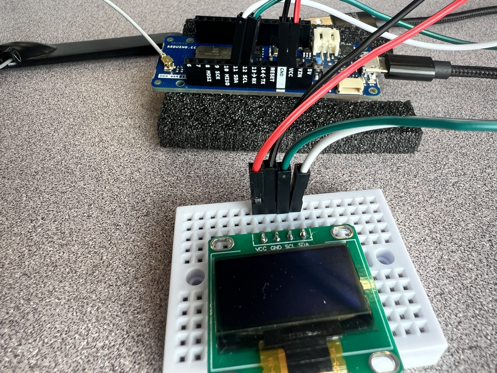


>TODO: include instructions on how to build it

## Installing Software

1. To connect to the `MKR WAN 1310` board, you will need to install the [Arduino IDE](https://support.arduino.cc/hc/en-us/articles/360019833020-Download-and-install-Arduino-IDE)
1. Once you installed the IDE, you need to further install the board's software support by following the [SAMD21 core for MKR boards Documentation](https://docs.arduino.cc/software/ide-v1/tutorials/getting-started/cores/arduino-samd)

   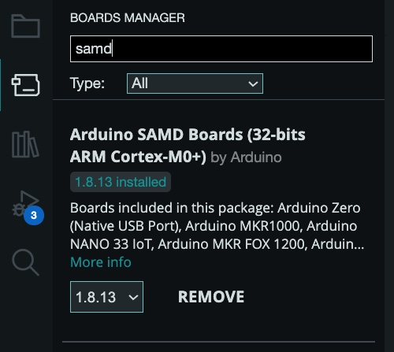
1. You will also need the library for mkrwan. Under Library Manager, look up "mkrwan" and install `MKRWAN by Arduino`.

   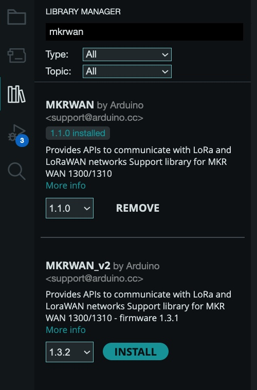
    
    >NOTE: At the time of configuring the board `MKRWAN_v2` was not used because of bug issues related to the library.

1. Two Arduino libraries must be installed to start using the display. The SSD1306 driver library is used to initialize the display and provide low level display functions. The GFX library provides graphics functions for displaying text, drawing lines and circles, etc. Both these libraries are available from Adafruit.

    > NOTE: if these two libraries are not found in the library manager, you can also follow this [tutorial](https://startingelectronics.org/tutorials/arduino/modules/OLED-128x64-I2C-display/) 

1. Install the SSD1306 Driver Library. Under Library Manager, look up "Adafruit SSD1306" and install `Adafruit SSD1306 by Adafruit`.

   

1. Install the GFX Library. Under Library Manager, look up "adafruit gfx library" and install `Adafruit GFX Library by Adafruit`.

   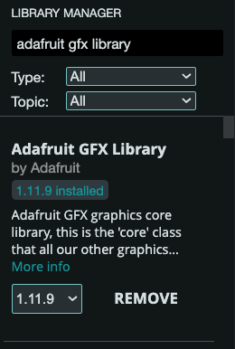

1. An additional library must be installed to get "i2c header", look up "Adafruit BusIO library" and install `Adafruit BusIO by Adafruit`.

   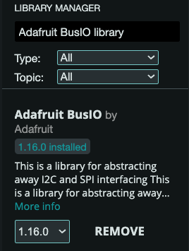

## Connect MKR WAN 1310 to Computer

1. Connect the board to your computer with the Micro USB wire
   - You should see a green light glow on the board

1. Go to Tools in Arduino IDE and select `Board` then select `Arduino SAMD Boards (32-bits ARM Cortex-M0+)` for the type of board. Finally select `Arduino MKR WAN 1310` for the board as shown: 

    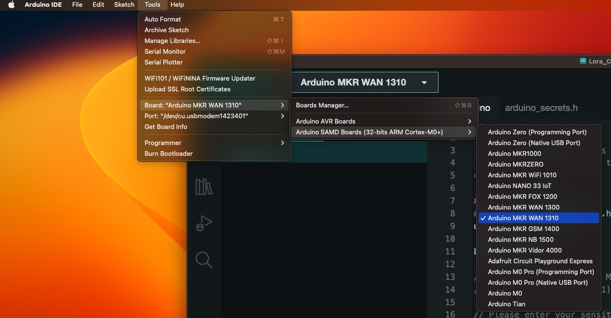

1. Then select the correct serial port for the arduino as shown:

    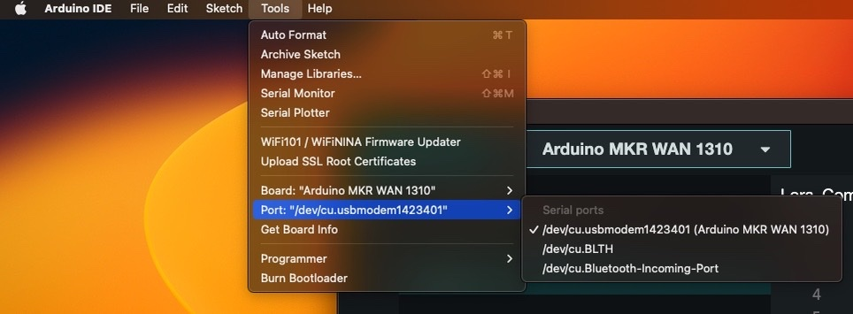

    >NOTE: If Arduino MKR WAN 1310 is not showing up, pressing the "RST" (reset) button twice in quick succession will put the board in bootloader mode. Instead of running a sketch the Arduino will wait until a sketch is uploaded helping the board to show up in your Arduino IDE. 

<!-- These sections aren't finished - FL
## Running the Software
>TODO: finish this section, and delete the example

1. Retrieve your MKR WAN 1310's DevEUI by using `setup.ino` in your `Arduino IDE`. The serial monitor will display your DevEUI. When you run `setup.ino` you should see a orange light glow on the board

    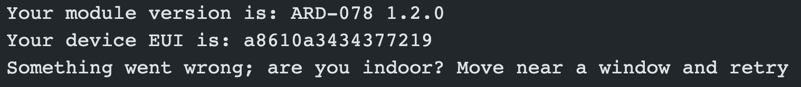

    >NOTE: The program will fail because the device hasn't been given an App key

1. Using the LoRaWAN Network Server’s portal or API, add your device with the option to use `OTAA` set to yes.

1. Once you've added your device, generate an application key.

1. Provide the application key to `arduino_secrets.h`

1. Run `setup.ino` in your `Arduino IDE`, if the device connects successfully the serial monitor will display the values the device is sending and your Network Server will receive a `join request` then the device's values.

    

    >NOTE: `main.ino` and `setup.ino` is using `US915` as its LoraWAN region. This must be changed in both files for different countries.

1. Finally for your Network Server to decript the uplink packets, use its portal or API to provide the codec: `codec.js`.

>NOTE: Once you are done debugging the device, you can comment out the serial commands such as print().

## Testing Device Using Chirpstack
>TODO: finish this section, and delete the example

[Chirpstack](https://www.chirpstack.io/) was used as our Network Server and a `RAK Discover Kit 2` was used as our Gateway.

1. Retrieve your MKR WAN 1310's DevEUI by using `main.ino` in your `Arduino IDE`. The serial monitor will display your DevEUI.

    

    >NOTE: The program will fail because the device hasn't been given an App key

1. Using Chirpstack's UI, add your device using `OTAA` following [Chirpstack's Documentation](https://www.chirpstack.io/docs/guides/connect-device.html)

1. Once you've added your device, generate an application key or create one via the 'OTAA Keys' tab.

    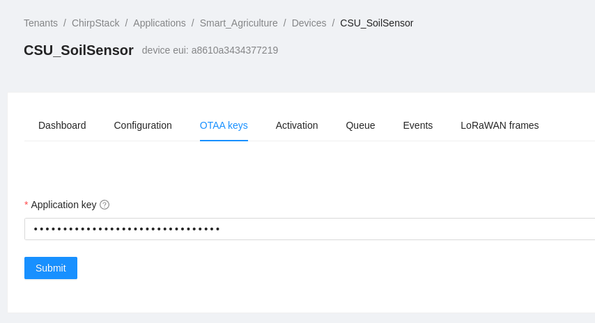

1. Provide the application key to `arduino_secrets.h`

    >NOTE: Chripstack does not use `APP EUI` when connecting devices via `OTAA` so this can be left as is.

1. Run `setup.ino` in your `Arduino IDE`, if the device connects successfully the serial monitor will display the values the device is sending and chirpstack will receive a `join request` then the device's values.

    

    

    >NOTE: The device might take a couple of minutes to join the LoRaWAN network.

1. Finally for chirpstack to decript the uplink packets, provide the `codec.js` via the Device Profile's Codec tab.

    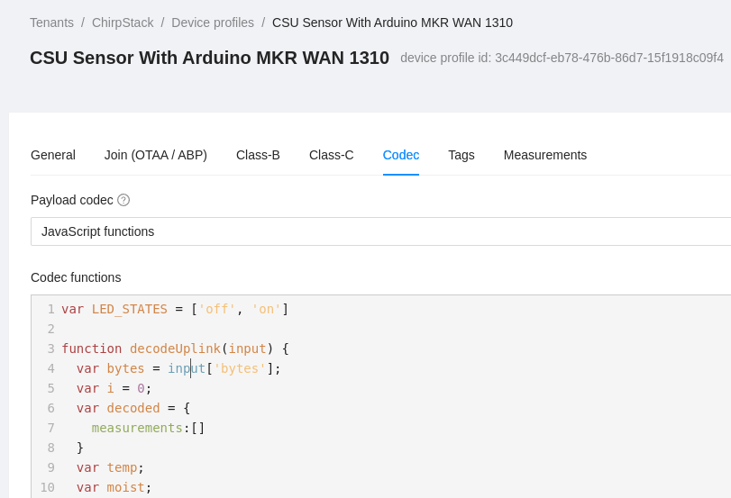

Viewing the uplink packets by clicking `up` in the device's events tab will now display the measurements and its values.

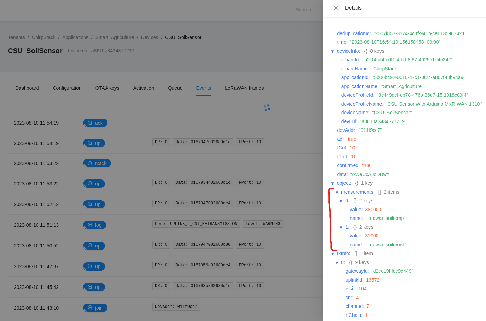 -->

# Future Work
- include instructions on how to connect the hardware